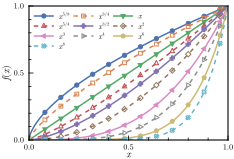
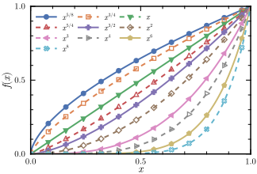

# MakiePublication.jl


**MakiePublication.jl** is a Julia package for producing publication quality figures based on [Makie.jl](https://github.com/JuliaPlots/Makie.jl). It aims to provide equivalent functionalities as the Python package [mpltex](https://github.com/liuyxpp/mpltex).

Read the [full documentation here](http://www.yxliu.group/MakiePublication.jl/dev/).

## Features

* Provide a collection of custom themes for journal publishers (ACS, APS, RSC) and some individual journals (JCAP, JHEP).
* Custom theme for making figures suitable for web pages.
* 15 color palettes based on well-known quality color schemes with special tweaked ordering for scientific publishing. (since v0.3.0)
* Support hollow markers. (since v0.3.1)

## Install

MakiePublication can be installed from the Julia REPL.

```console
julia> # Press the key "]"

(@v1.8) pkg> add MakiePublication
```

## Quick Start

MakiePublication provides a number of `theme_*` methods to generate themes (`Makie.Theme` instances) which can be given to [Makie's theming methods](https://docs.makie.org/stable/documentation/theming/index.html): `set_theme!`, `update_theme!`, and `with_theme`. A typical usage pattern is

```julia
using MakiePublication
using CairoMakie

with_theme(theme_web()) do
    lines(0..10, sin)
    lines!(0..10, cos)
    current_figure()
end
```

Or if you have a more complicated plotting function,

```julia
function myplot()
    fig = Figure(figure_padding=(2, 6, 1, 6))
    ax = Axis(fig, xlabel=L"x", ylabel=L"f(x)")
    lines!(ax, 0..10, sin)
    lines!(ax, 0..10, cos)

    fig[1,1] = ax
    fig
end

with_theme(myplot, theme_web())
```

Check out the [documentation](http://www.yxliu.group/MakiePublication.jl/dev/) for more details.

## Colors

The default color cycle is 10-color [seanborn_deep](https://juliagraphics.github.io/ColorSchemes.jl/stable/catalogue/#Seaborn) (since v0.2.3). MakiePublication also provides 15 carefully chosen color palettes based on well-known palettes, such as `tab10`, `tableau_10`, `Makie.wong_colors`, `okabe_ito`, etc. The colors in each palette has been reordered if necessary to be consistent with the order of the default matplotlib color palette, `tab10`. The order is: blue, orange, green, red, purple, brown, pink, gray, yellow, and cyan. You can choose it from the array `MakiePublication.COLORS` and use it like this:

```julia
with_theme(myplot, theme_web(colors=MakiePublication.COLORS[5]))
```

Or obtain the color palette by calling a function:

```julia
with_theme(myplot, theme_web(colors=MakiePublication.tol_bright()))
```

The demonstration of available color palettes can be found in the Pluto notebook `doc/makiepub_colors.jl.html`.

## Showcase of Themes

Note the difference of physical size among figures. APS figures have ticks on all four axes (new in v0.4.1).

- `theme_acs` for American Chemical Society (ACS)



- `theme_aps` for American Physical Society (APS) and American Institute of Physics (AIP)



- `theme_rsc` for Royal Society of Chemistry (RSC)


## Documentation

The [full documentation](http://www.yxliu.group/MakiePublication.jl/dev/) is available [here](http://www.yxliu.group/MakiePublication.jl/dev/).

## Contribute

* Star the package on [github.com](https://github.com/liuyxpp/MakiePublication.jl).
* File an issue or make a pull request on [github.com](https://github.com/liuyxpp/MakiePublication.jl).
* Pull requests of new schemes for other publishers and journals are highly appreciated.
* Contact the author via email <lyx@fudan.edu.cn>.
