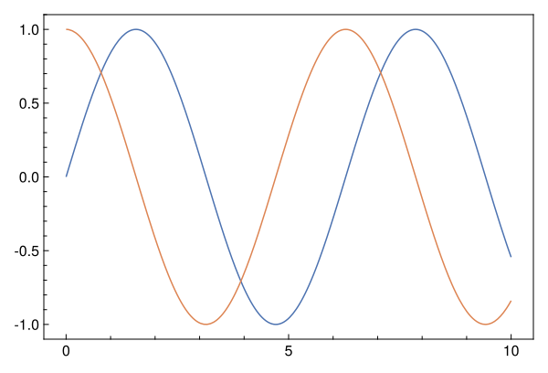
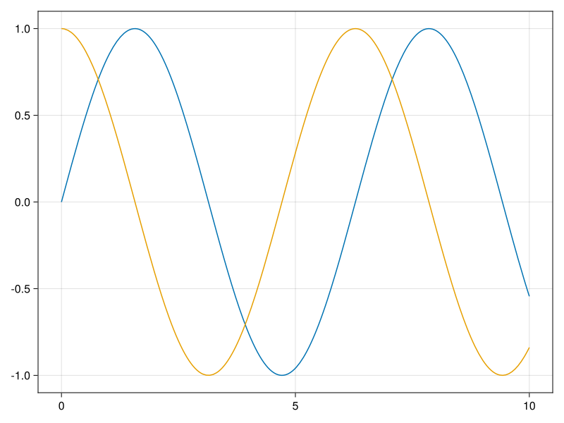

# Tutorial

*The tutorial as a Pluto notebook is available [here](tutorial.jl)*

To use MakiePublication, we need to import it together with the CairoMakie.jl package. MakiePublication use CairoMakie since it aims to produce figures for journal publishing which often requires vector graphics in the formats of PDF, EPS, and SVG.

```julia
using MakiePublication
using CairoMakie
```

## Simple Plots

For simple plots, we can use `with_theme` block:

```julia
with_theme(theme_web()) do
    lines(0..10, sin)
    lines!(0..10, cos)
    current_figure()
end
```

The output figure is:



As compared to the Makie default theme:



## Complicated Plots

`with_theme` can be also called with a plotting function. The following plotting function demonstrates how to:

- plot fitted lines and data points together
- draw a legend at desired location and its padding, columns.
- tune the padding of a figure with respect to canvas
- tune axis limits

```julia
# web theme: figure_padding=(2, 16, 2, 8), legend_margin=((15,0,0,10)
# other themes: figure_padding=(2, 6, 1, 6), legend_margin=((5,0,0,0)
function myplot(; figure_padding=(2,6,1,6), legend_margin=((5,0,0,0)))
    x = 0:0.001:1.0
    xs = 0:0.08:1.0
    fig = Figure(figure_padding=figure_padding)
    ax = Axis(fig, xlabel=L"x", ylabel=L"f(x)")

    l1 = lines!(ax, x, x.^(5/8), label=L"x^{5/8}")
    s1 = scatter!(ax, xs, xs.^(5/8))
    l2 = lines!(ax, x, x.^(3/4), label=L"x^{3/4}")
    s2 = scatter!(ax, xs, xs.^(3/4))
    l3 = lines!(ax, x, x, label=L"x")
    s3 = scatter!(ax, xs, xs)
    l4 = lines!(ax, x, x.^(5/4), label=L"x^{5/4}")
    s4 = scatter!(ax, xs, xs.^(5/4))
    l5 = lines!(ax, x, x.^(3/2), label=L"x^{3/2}")
    s5 = scatter!(ax, xs, xs.^(3/2))
    l6 = lines!(ax, x, x.^2, label=L"x^2")
    s6 = scatter!(ax, xs, xs.^2)
    l7 = lines!(ax, x, x.^3, label=L"x^3")
    s7 = scatter!(ax, xs, xs.^3)
    l8 = lines!(ax, x, x.^4, label=L"x^4")
    s8 = scatter!(ax, xs, xs.^4)
    l9 = lines!(ax, x, x.^6, label=L"x^6")
    s9 = scatter!(ax, xs, xs.^6)
    l10 = lines!(ax, x, x.^8, label=L"x^8")
    s10 = scatter!(ax, xs, xs.^8)

    xlims!(0, 1)
    ylims!(0, 1)

    axislegend(ax, [[l1, s1], [l2, s2], [l3, s3], [l4, s4], [l5, s5], [l6, s6], [l7, s7], [l8, s8], [l9, s9], [l10, s10]],
        [L"x^{5/8}", L"x^{3/4}", L"x", L"x^{5/4}", L"x^{3/2}", L"x^2", L"x^3", L"x^4", L"x^6", L"x^8"], nbanks=3, position=:lt, margin=legend_margin, padding=(0,0,0,0))
    
    fig[1,1] = ax
    
    return fig
end

myplot_web() = myplot(figure_padding=(2, 16, 2, 8), legend_margin=(15,0,0,10))
```

Applying CairoMakie default theme with following code

```julia
myplot_web()
```

which produces


Theming it by MakiePublication web theme with following code

```julia
with_theme(myplot_web, theme_web())
```

which produces


Notable changes are:

- Resolution and figure aspect ratio
- Color palette from `Makie.wong_colors` to `seaborn_deep`
- Frameless figure legend
- Visible minor ticks
- Marker size
- Spine width
- Label font size

## Color Palettes

MakiePublication has 15 built-in color palettes. We can choose a color palette from the array `MakiePublication.COLORS` and use it like this:

```julia
with_theme(myplot_web, theme_web(colors=MakiePublication.COLORS[5]))
```

Note we arrange the order of the color palettes in `COLORS` by how strongly we recommend it. The first is the most recommended color palette which is the MakiePublication default, i.e. `seaborn_deep`.

Or obtain the color palette by calling a function:

```julia
with_theme(myplot_web, theme_web(colors=MakiePublication.tol_bright()))
```

The resulted figure is


## Line Styles

By default, the line styles are given by `MakiePublication.LINESTYLES`. You can overwrite it with `linestyles` keyword of `theme_*` methods.

Moreover, the default cycle for `Line` plots does not cycle line styles. To cycle line styles, you have to pass a proper cycle using either `cycle` or `linecycle` keyword argument. See the example below:

```julia
lc = Cycle([:color, :linestyle], covary=true)
# Only solid and dashed line styles are cycled.
with_theme(myplot_web, theme_web(linecycle=lc, linestyles=[nothing, :dash]))
```

which produces


## Markers

By default, the markers are given by `MakiePublication.MARKERS`. You can overwrite it with `makers` keyword of `theme_*` methods.

```julia
# Only circle and diamond markers are cycled.
with_theme(myplot_web, theme_web(markers=[:circle, :diamond]))
```

which produces


## Hollow Markers

MakiePublicaion supports drawing hollow markers by using transparent color for marker face and drawing strokes only.

To draw hollow markers, we have to explicitly define a marker cycle including both `:color=>:markercolor` and `:strokecolor=>:color`, e.g.

```julia
Cycle([:color=>:markercolor, :strokecolor=>:color])
```

Moreover, we have to define a list of `true` or `false` values which indicates the ordering of whether the marker is hollow, and pass it to the `ishollowmarkers` keyword argument. For example,

```julia
[false, true]
```

It will make every second marker hollow.

You can also change the stroke width by passing the value to the `makerstrokewidth` keyword argument.

A full example is:

```julia
sc = Cycle([:color=>:markercolor, :strokecolor=>:color], covary=true)
with_theme(myplot_web, theme_web(scattercycle=sc, ishollowmarkers=[false, true], markerstrokewidth=1.5))
```

which produces


## Cyclers

Cycler is extremely powerful. Using it properly can produce very complicated figures. See the example below:

```julia
lc = Cycle([:color, :linestyle], covary=true)
sc = Cycle([:color=>:markercolor, :strokecolor=>:color, :marker], covary=true)
with_theme(myplot_web,
theme_web(
    colors=MakiePublication.tableau_10(),
    linestyles=[nothing, :dash, :dash],
    ishollowmarkers=[false, true, false],
    markers=[:circle, :diamond, :rtriangle],
    linecycle=lc,
    scattercycle=sc,
    markerstrokewidth=1.5)
)
```

which produces


## Saving A Figure As An Image File

There are two ways to save a figure as an image file.

- Use `savefig`. Provide a file path with desired extension, such as `pdf`, `eps`, `svg`, `png`, etc., such as

```julia
fig = with_theme(myplot, theme_acs())
savefig("plot.svg", fig)
```

For web display, we recommend use `svg` format for the image file.

- Use `save`. The image size can be further customized with keyword `px_per_unit`, whose default value is 1. Increasing it will increase the resolution as well as the image size.

```julia
fig_web = with_theme(myplot_web, theme_web())
save("plot_web.png", fig_web, px_per_unit=4)
```
